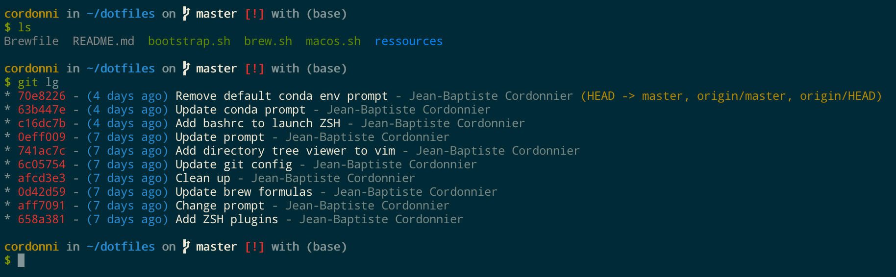
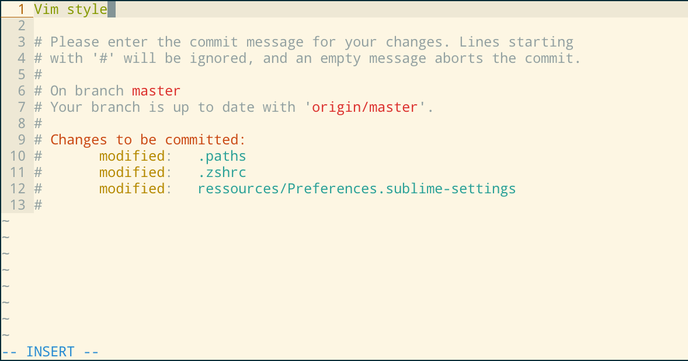

# JB's Dotfiles

These are my dot files for macOS and Linux. Feel free to use them.

To install them check out the dependencies below and run the following commands:

```bash
cd
git clone https://github.com/jbcdnr/dotfiles.git
cd dotfiles
./bootstrap.sh  # type 'y' to confirm
```

Please open an issue if you get in troubles.

## Preview




## Dependencies

### macOS config

Follow the [setup instruction](macos-setup.md). 

## Credits

- [dircolors-solarized](https://github.com/seebi/dircolors-solarized) for `ls` coloring,
- [intellij-colors-solarized](https://github.com/jkaving/intellij-colors-solarized) for iTerm and IntelliJ.
